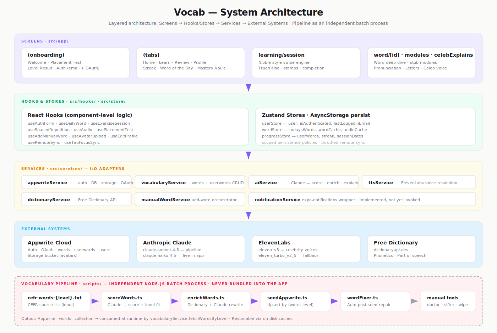
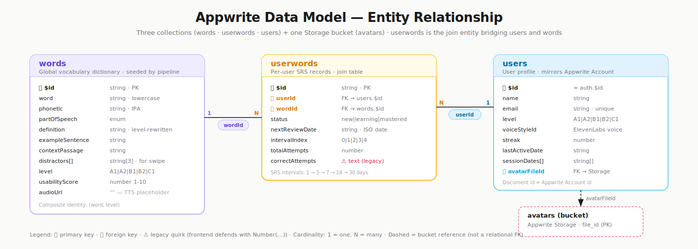
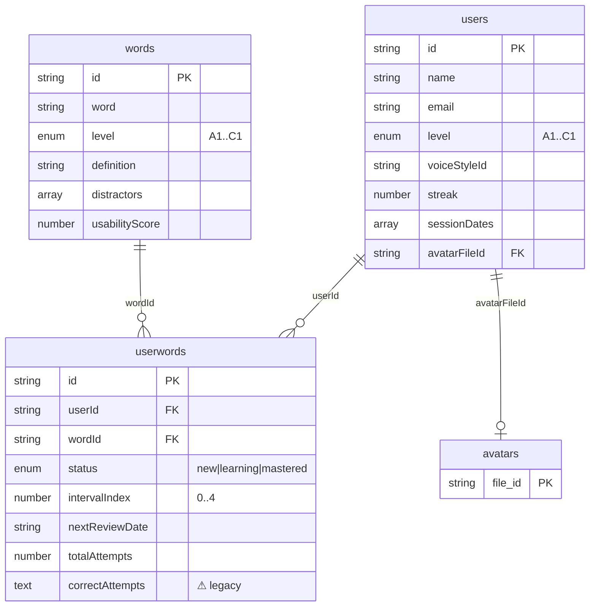
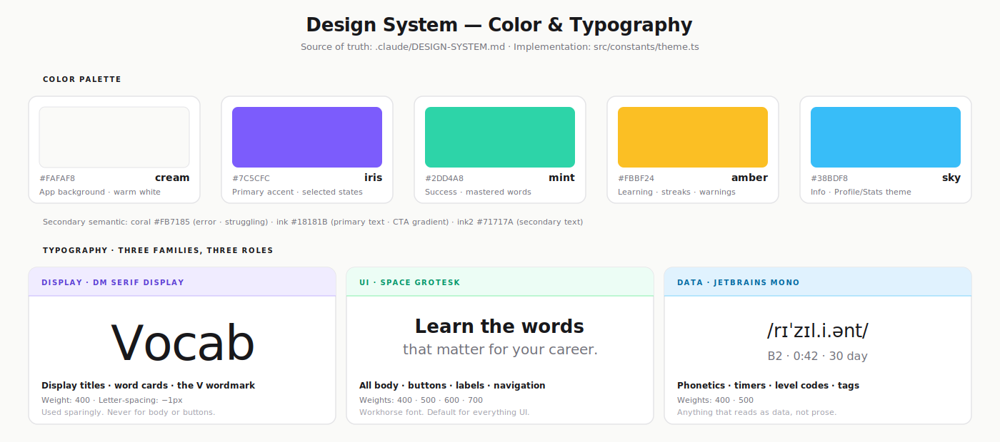

# Vocab — Visual Reference / Görsel Referans

> Tezde kullanılacak tüm görsel artefaktların tek noktadan referansı. Üç bağımsız SVG dosyası — her biri tezde ayrı bir görsel olarak kullanılabilir.

| Dosya | Boyut | İçerik |
|---|---|---|
| **`architecture.svg`** | 1400 × 940 | Sistem mimarisi — katmanlı diyagram + bağımsız Pipeline kutusu |
| **`data-model.svg`** | 1400 × 500 | Veri modeli — Appwrite koleksiyonları arası ER diyagramı |
| **`design-system.svg`** | 1400 × 620 | Tasarım sistemi — renk paleti + üç font ailesi örnekleriyle |

Üç dosya da bağımsız: her birinin kendi başlığı, alt başlığı ve içeriği vardır. Tezde bunları teker teker farklı sayfalara yerleştirebilirsin.

İsteğe bağlı: `architecture.mmd` üç bölüm için de Mermaid kaynaklarını içerir (yeniden düzenleme/render için).

---

## 1 — System Architecture (`architecture.svg`)



**Ne anlatıyor.** Uygulamanın mantıksal katmanları yukarıdan aşağıya:

1. **Screens** (Expo Router file-based routing) — `(onboarding)`, `(tabs)`, `learning/session`, `word/[id]`, modüller
2. **Hooks & Stores** — 10 React hook + 3 Zustand store, her birinin persist politikası farklı
3. **Services** — 7 I/O adapter; uygulamadan dış sistemlere giden tek köprü
4. **External Systems** — Appwrite, Claude (Sonnet + Haiku), ElevenLabs, Free Dictionary
5. **Vocabulary Pipeline** — kesik çizgili kutu, app'e bundle edilmeyen Node-only batch süreç

Iris oklar app içi katman akışını gösterir; pipeline'dan dış sistemlere giden noktalı oklar batch sürecinin Appwrite'a yazıp Claude/Dictionary'i çağırdığını işaret eder.

**Tezde kullanımı.** "Sistemin mimari yapısı şu şekildedir..." gibi bir paragrafın altına tam genişlikte yerleştir.

---

## 2 — Data Model / ER (`data-model.svg`)



`words ←(wordId)— userwords —(userId)→ users` ilişkisi, üçüncü ayak olarak `users.avatarFileId → Storage:avatars` ile birlikte.

**Üç koleksiyon, bir bucket:**

| Koleksiyon | Rol | Anahtar alanlar |
|---|---|---|
| `words` | Global sözlük — pipeline tarafından doldurulur | `$id`, `word`, `level`, `definition`, `distractors[]`, `usabilityScore` |
| `userwords` | Per-user spaced-repetition kayıtları (join entity) | `$id`, `userId` (FK), `wordId` (FK), `status`, `intervalIndex`, `nextReviewDate` |
| `users` | Kullanıcı profili — Appwrite Account'un ayna kaydı | `$id`, `name`, `email`, `level`, `voiceStyleId`, `streak`, `sessionDates[]`, `avatarFileId` (FK) |
| `avatars` (bucket) | Profil fotoğrafları | Appwrite Storage'da `file_id` ile saklı |

**Önemli noktalar:**
- `userwords` saf bir **join table**'dır: bir kullanıcıyı bir kelimeye bağlar ve o ilişkiye özgü SRS durumunu tutar (`intervalIndex`, `status`, `nextReviewDate`).
- `users.$id` doğrudan **Appwrite Account `$id`'sine eşittir**. Profil dokümanı oluşturulurken `ID.unique()` değil, hesap kimliği kullanılır — böylece auth ve profil 1:1 eşleşir.
- `words.distractors[]` alanı `learning/session`'daki True/False mekaniği için bilinçli olarak üç yanlış tanım tutar. Manuel eklenen kelimelerde Claude Haiku ile sonradan üretilir.
- `correctAttempts` **`text` tipinde** saklanır (erken şema kararı). Frontend her okumada `Number(...)` ile defansif dönüşüm yapar. ER diyagramında ⚠ ile işaretli.
- `users.email` Appwrite Account ile birlikte `unique` constraint'lidir. Email değişiklikleri Appwrite güvenlik gereği mevcut şifre ile doğrulanır.

**Mermaid alternatifi (klasik Chen ER notasyonu):**



---

## 3 — Design System (`design-system.svg`)



`src/constants/theme.ts` içinde tanımlı, `.claude/DESIGN-SYSTEM.md` belgesinden referans alınır.

### Renk Paleti (5 ana renk)

| Sıra | Token | Hex | Rol |
|---|---|---|---|
| 1 | **cream** | `#FAFAF8` | Uygulama arka planı — saf beyaz değil, **ılık krem** |
| 2 | **iris** | `#7C5CFC` | Birincil aksan · seçili durumlar · `vocab.` wordmark noktası |
| 3 | **mint** | `#2DD4A8` | Başarı durumu · `mastered` kelimeler · "All caught up" kartı |
| 4 | **amber** | `#FBBF24` | Öğrenme durumu · streak · uyarılar |
| 5 | **sky** | `#38BDF8` | Bilgi · Profile/Stats sekmesinin teması |

**İkincil semantik renkler:**
- `coral` `#FB7185` — hata · `struggling` kelime · logout
- `ink` `#18181B` — birincil metin · CTA gradient'inin başlangıcı (`#18181B → #27272A`)
- `ink2` `#71717A` — ikincil metin
- `inkLight` `#A1A1AA` — placeholder, devre dışı durumlar

**Tasarım kararı (önemli):** Birincil CTA'lar **iris değil, dark gradient** kullanır. Iris seçili/aktif durumlar için ayrılmıştır. Bu, krem arka plan üzerinde butonların "premium" hissini garanti eder.

### Tipografi (üç aile, üç rol)

| Aile | Rol | Kullanım | Örnek |
|---|---|---|---|
| **DM Serif Display** | Display | Yalnızca büyük, etkili başlıklar — kelime kartları, ekran başlıkları, `V` wordmark | "Vocab" |
| **Space Grotesk** | UI | Her şey: butonlar, etiketler, gövde metni, navigasyon | "Learn the words that matter." |
| **JetBrains Mono** | Data | Fonetik transkripsiyonlar, sayaçlar, seviye kodları (`A1`, `B2`), zamanlayıcılar | `/rɪˈzɪl.i.ənt/` |

**Kuralı tek cümleyle:** *Serif kelimeler için, sans UI için, mono veri için. İstisna yok.*

---

## Export & Tez Entegrasyonu

Üç dosya da saf vektör. Her birini tezde ayrı bir görsel olarak kullanabilirsin.

| Hedef | Yöntem |
|---|---|
| **Word / Google Docs** | SVG'yi doğrudan sürükle-bırak ile ekle. Word 2019+ ve Google Docs SVG'yi destekler. |
| **LaTeX** | `inkscape <dosya>.svg --export-type=pdf -o <dosya>.pdf` sonra `\includegraphics[width=\textwidth]{<dosya>.pdf}`. PDF vektör kalitesini korur. |
| **PowerPoint** | Doğrudan SVG ekle (Office 365). Eski sürümler için PNG'ye çevir. |
| **PNG (300 dpi)** | `rsvg-convert -d 300 -p 300 -f png <dosya>.svg > <dosya>.png` (`brew install librsvg`) <br/>veya `inkscape <dosya>.svg --export-type=png --export-dpi=300 -o <dosya>.png` |

### Üç dosyayı tek seferde PNG'ye çevir

```bash
for f in architecture data-model design-system; do
  rsvg-convert -d 300 -p 300 -f png "${f}.svg" > "${f}.png"
done

# veya Inkscape ile:
for f in architecture data-model design-system; do
  inkscape "${f}.svg" --export-type=png --export-dpi=300 -o "${f}.png"
done
```

### Üç dosyayı tek seferde PDF'e çevir (LaTeX için)

```bash
for f in architecture data-model design-system; do
  inkscape "${f}.svg" --export-type=pdf -o "${f}.pdf"
done
```

### Mermaid'i yeniden render etmek

`architecture.mmd` üç bölümün de Mermaid kaynağını içerir (sistem mimarisi için `flowchart TB`, veri modeli için `erDiagram`). Her bloğu ayrı ayrı render etmek için:

```bash
npm i -g @mermaid-js/mermaid-cli
mmdc -i architecture.mmd -o architecture-mermaid.png -w 2000 -H 2400
```

Veya `https://mermaid.live` adresine ilgili `%% PART X` bloğunu yapıştır, anında PNG/SVG indir.

---

## Sürüm ve Bakım

| Dosya | Amaç | Düzenleme önceliği |
|---|---|---|
| `architecture.svg` | Sistem mimarisi (PART 1) | Yüksek |
| `data-model.svg` | Appwrite ER diyagramı (PART 2) | Yüksek |
| `design-system.svg` | Renk + tipografi (PART 3) | Yüksek |
| `architecture.mmd` | Mermaid kaynak — diff'lenebilir, yeniden düzenlenebilir | Orta |
| `visuals.md` | Bu doküman — referans / indeks | Düşük |
| `.claude/DESIGN-SYSTEM.md` | Tasarım sisteminin canonical kaynağı | Yüksek — `design-system.svg`'nin arkasındaki gerçek |
| `src/constants/theme.ts` | Tasarım sisteminin TypeScript implementasyonu | Yüksek — kod tarafında DESIGN-SYSTEM.md ile senkron tutulmalı |

**Senkronizasyon kuralları:**
- Bir koleksiyon şeması değişirse → `data-model.svg` + Mermaid `erDiagram` bloğunu birlikte güncelle.
- Bir renk veya font eklenirse → `design-system.svg` + `.claude/DESIGN-SYSTEM.md` + `src/constants/theme.ts`'i birlikte güncelle.
- Yeni bir hook/service/screen eklenirse → `architecture.svg` + `architecture.mmd` PART 1 bloğunu birlikte güncelle.
